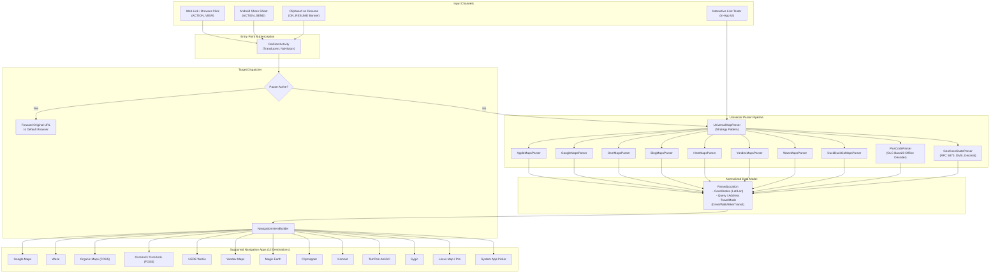

# MapFlip Architecture & Technical Design

This document details the system architecture, component boundaries, privacy guarantees, and design decisions of MapFlip.

---

## 1. Architectural Overview & Philosophy

MapFlip is designed as a **100% offline, privacy-first intent router** for Android. Its primary responsibility is intercepting map URLs and geo-intents from proprietary or web-based services (such as Apple Maps or DuckDuckGo) and redirecting them directly into native navigation apps on Android.

---

## 2. Core Subsystems

### 2.1 Parser Pipeline (`UniversalMapParser`)
The parsing layer implements the **Strategy Pattern**. Each map source is an isolated, independently unit-tested implementation of `MapUrlParser`:

* **`AppleMapsParser`**: Parses `maps.apple.com` and `applemaps://` queries (`?q=`, `?ll=`, `?address=`, `?saddr=&daddr=`, place slugs `/p/...`).
* **`GoogleMapsParser`**: Handles `maps.google.com`, `google.com/maps`, `goo.gl/maps` and shortlinks.
* **`OsmMapsParser`**: Extracts nodes, ways, relations, and bounding-box coordinates from `openstreetmap.org` and `osm.org`.
* **`BingMapsParser`**: Parses `bing.com/maps` coordinates (`cp=`) and search queries.
* **`HereMapsParser`**: Supports path-based coordinates (`/l/lat,lon,zoom`) and query parameters (`map=lat,lon`).
* **`YandexMapsParser`**: Handles Yandex inverted coordinate order (`ll=lon,lat`).
* **`WazeMapsParser`**: Extracts destination coordinates from `waze.com/ul` and `live-map/directions`.
* **`DuckDuckGoMapsParser`**: Intercepts map search and directions links while passing generic web searches cleanly to the browser.
* **`PlusCodeParser`**: 100% offline mathematical decoding of Open Location Codes (Google Plus Codes, Base20 algorithm) without network lookup.
* **`GeoCoordinateParser`**: Extracts standard `geo:` URIs (RFC 5870), Degree-Minute-Second (DMS) coordinates, and decimal coordinate pairs with strict sanity filtering.

### 2.2 Navigation Intent Dispatcher (`NavigationIntentBuilder`)
Translates the normalized `ParsedLocation` into platform-native intents:
1. **App-Specific Schemes**: Directly targets installed navigation apps via custom URI schemes (e.g. `geo:`, `google.navigation:`, `om://`, `osmand.geo:`, `here-route://`, `yandexmaps://`).
2. **Travel Mode Preservation**: Carries over driving, walking, cycling, and public transit modes from source links into compatible navigation intents.
3. **Smart Fallback**: If the user's chosen navigation app was uninstalled, MapFlip catches the `ActivityNotFoundException`, displays a localized toast notice, and gracefully falls back to the system app chooser.

### 2.3 Android 12+ Deep Link Verification (`DomainVerificationHelper`)
Android 12 (API 31+) restricts unverified HTTP/HTTPS link handling:
* MapFlip provides a visual **`SetupGuideBottomSheet`** that guides users through link activation in 3 numbered steps.
* `DomainVerificationManager` dynamically inspects `hostToStateMap` to determine whether all 18 domains are verified or selected (`DOMAIN_STATE_SELECTED` / `DOMAIN_STATE_VERIFIED`).
* Live badge in the main screen reflects real-time link enablement status.

### 2.4 Pause Subsystem & Quick Settings Tile
* **`PauseHelper`**: Allows users to pause redirection for 1 hour, 8 hours, until tomorrow morning (06:00 AM with proper timezone boundary arithmetic), or indefinitely.
* **`MapFlipTileService`**: System Quick Settings tile allowing 1-tap toggling of the pause state directly from the notification shade without launching the app.

---

## 3. Flavor Separation & Privacy Architecture

MapFlip is built with a strict separation between open-source distribution and store distribution:

| Feature / Property | `foss` Flavor (F-Droid & GitHub) | `play` Flavor (Google Play Store) |
|---|---|---|
| **Internet Permission** | **None** (`android.permission.INTERNET` omitted) | Declared for anonymous telemetry |
| **Telemetry Implementation** | **100% No-Op Stub** (`Analytics.kt` empty methods) | Lightweight HTTP dispatcher for self-hosted Aptabase |
| **Telemetry Payload** | Zero (no network sockets possible at kernel level) | Anonymous event name & app version (no coordinates or URLs) |
| **Google Play Services** | None | In-App Review API prompt only |
| **Monetization / Ads** | Zero | Zero |

### Kernel-Level Verification
In the `foss` flavor, `aapt2 dump permissions` confirms that `android.permission.INTERNET` is completely absent. Because the Linux kernel does not assign GID 3003 (`AID_INET`) to the app's process, it is mathematically and physically impossible for the app to open network sockets.

---

## 4. Testing & Quality Assurance

* **Unit Test Suite**: Over 120 deterministic unit tests covering parsers, timezones, encoding, locales, and domain verification.
* **Clean Code & Zero External Dependencies**: The core FOSS build relies solely on AndroidX and standard Kotlin/Compose libraries.
